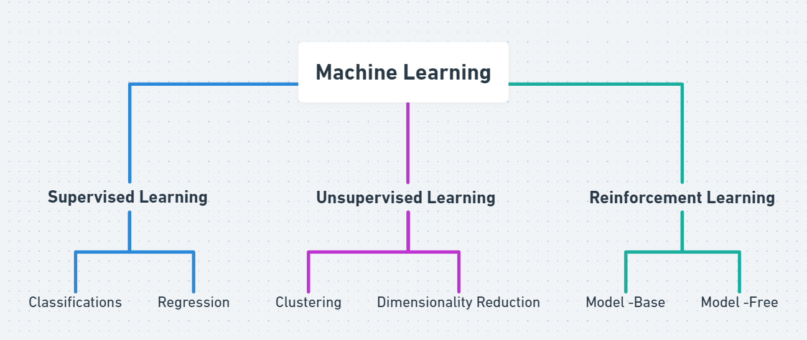

# Machine-Learning
"Field of Study that givies computer the capability to learn without being explicity programmed"

## 1. Supervised Machine Learning:
Supervised learning is a type of machine learning in which the algorithm is trained on the labeled dataset.

There are two main types of supervised learning:

###  a] Regression: 
Regression is a type of supervised learning where the algorithm learns to predict continuous values based on input features. The output labels in regression are continuous values, such as stock prices, and housing prices. The different regression algorithms in machine learning are: Linear Regression, Polynomial Regression, Ridge Regression, Decision Tree Regression, Random Forest Regression, Support Vector Regression, etc

### b] Classification: 
Classification is a type of supervised learning where the algorithm learns to assign input data to a specific category or class based on input features. The output labels in classification are discrete values. Classification algorithms can be binary, where the output is one of two possible classes, or multiclass, where the output can be one of several classes. The different Classification algorithms in machine learning are: Logistic Regression, Naive Bayes, Decision Tree, Support Vector Machine (SVM), K-Nearest Neighbors (KNN), etc

## 2. Unsupervised Machine Learning:
Unsupervised learning is a type of machine learning where the algorithm learns to recognize patterns in data without being explicitly trained using labeled examples.

There are two main types of unsupervised learning:

### a] Clustering: 
Clustering algorithms group similar data points together based on their characteristics. The goal is to identify groups, or clusters, of data points that are similar to each other, while being distinct from other groups. Some popular clustering algorithms include K-means, Hierarchical clustering, and DBSCAN.
### b] Dimensionality reduction: 
Dimensionality reduction algorithms reduce the number of input variables in a dataset while preserving as much of the original information as possible. This is useful for reducing the complexity of a dataset and making it easier to visualize and analyze. Some popular dimensionality reduction algorithms include Principal Component Analysis (PCA), t-SNE, and Autoencoders.

## 3. Reinforcement Machine Learning
Reinforcement learning is a type of machine learning where an agent learns to interact with an environment by performing actions and receiving rewards or penalties based on its actions. The goal of reinforcement learning is to learn a policy, which is a mapping from states to actions, that maximizes the expected cumulative reward over time.

There are two main types of reinforcement learning:

### a] Model-based reinforcement learning: 
In model-based reinforcement learning, the agent learns a model of the environment, including the transition probabilities between states and the rewards associated with each state-action pair. The agent then uses this model to plan its actions in order to maximize its expected reward. Some popular model-based reinforcement learning algorithms include Value Iteration and Policy Iteration.
### b] Model-free reinforcement learning: 
In model-free reinforcement learning, the agent learns a policy directly from experience without explicitly building a model of the environment. The agent interacts with the environment and updates its policy based on the rewards it receives. Some popular model-free reinforcement learning algorithms include Q-Learning, SARSA, and Deep Reinforcement Learning.
